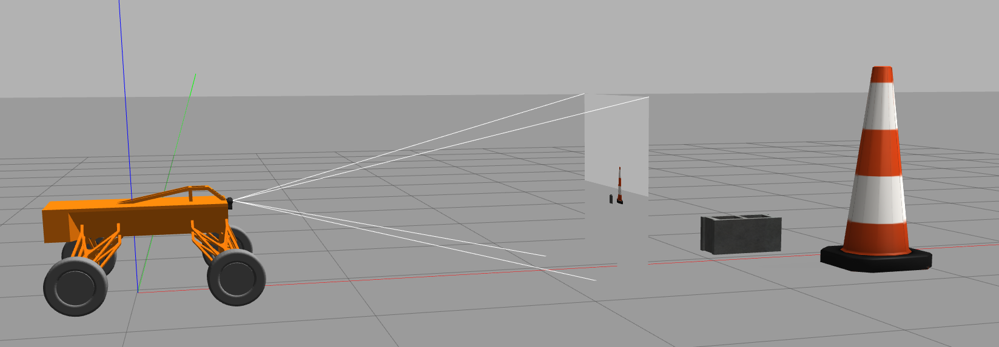
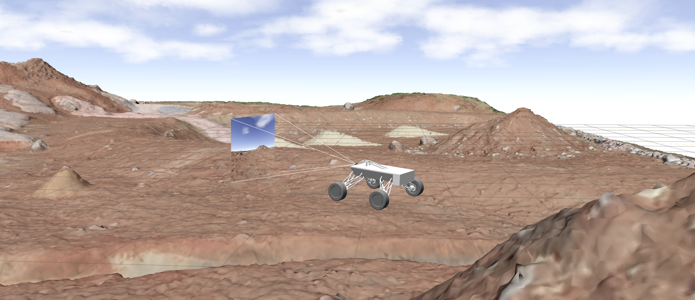

# Innspace Rover Autonomous Navigation System
---
This is a Innspace Rover Autonomous Navigation System implemented in ROS2 Humble. Workspace contains set of packages that enable to simulate, test, use and integrate systems required for autonomous navigation tasks.

## Table of contents
---

1. Installation
2. System documentation
3. Usage guide

### 1. Installation
---
Run set of commands in your terminal:
1. Create workdir and src folder
<pre><code>mkdir innspace_rover
</code></pre>

2. Clone the repository 
<pre><code>git clone git@github.com:kafrankowska/innspace_rover.git
rosdep install --from-paths src -r -y
colcon build --symlink-install
</code></pre>

3. Launch simulation
<pre><code>source install/setup.bash
ros2 launch rover_description launch_sim.launch.py
</code></pre>

### 2. System description
---
> Packages list: 
> 
> - __rover_description__ - package containing rover description
>  - __rover_simulation__ - package responsible for defining simulation enviroment
>  - __rover_localization__ - package meant to integrate rover's odometry system. It fuses information coming from wheel encoders, IMU and GPS and it publishes smooth Odometry frames with <mark>odom</mark> which is transfered to <mark>base_link</mark>

### rover_description
---

This package aims to declare robot structure, sensors, and driver controller in order to simulate robot behaviour in Gazebo and/or RVIZ.

Rover is equipped with OAK-D lite stereo camera and IMU system. Rover description  assumes differential drive controller which can be handeled with twist teleoperation.

 For keyboard teleop type in terminal: 
 <pre><code>
 ros2 run teleop_twist_keyboard teleop_twist_keyboard --ros-args -r /cmd_vel:=/diff_cont/cmd_vel_unstamped
 </code></pre>

### rover_simulation
---

Rover simulation package is responsible for launching different declared gazebo simulations enviroments. Rover_description package is mandatory for simulation. User is able to check performance of rover's systems and implemented algorithms.

Package contains following worlds scenarios:
> - __ERC 2022 Marsyard World__ - 3D enviroment model provided by ERC organizators

### rover_localization
---
Package provides smooth and accurate odometry information based on fused sensor information from the data provided by wheel encoders and IMU platform. through geometry_msgs/PoseWithCovarianceStamped and geometry_msgs/TwistWithCovarianceStamped. 

Package uses  Extended Kalman filter state stmiator to implement fusion. 

Future release shall increase functionality with navsat_transform_node which transforms geographic coordinates into the robot’s world frame  that enables working with GPS systems. 

Main resource for this package is provided in this docs: 
https://navigation.ros.org/setup_guides/odom/setup_odom.html#configuring-robot-localization

